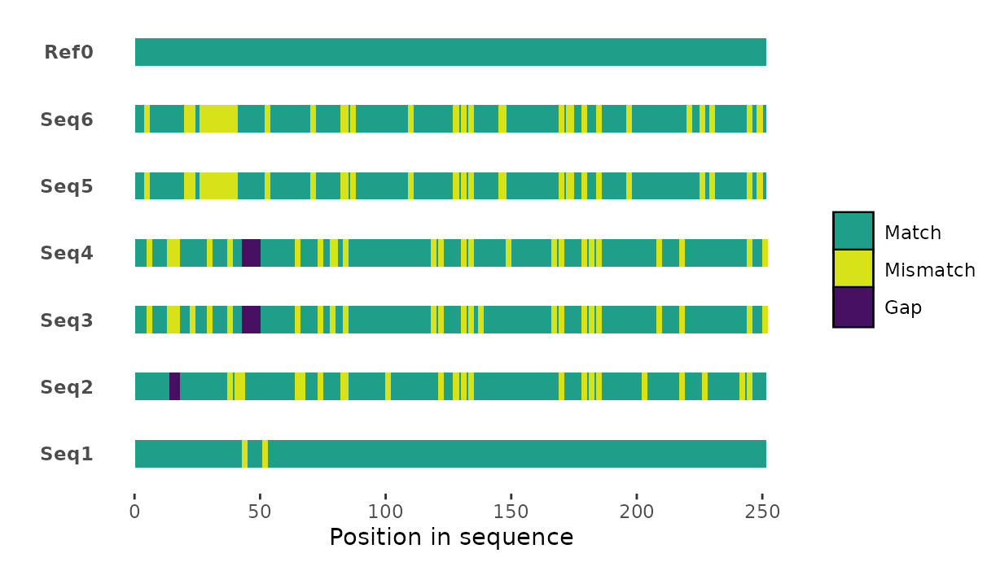
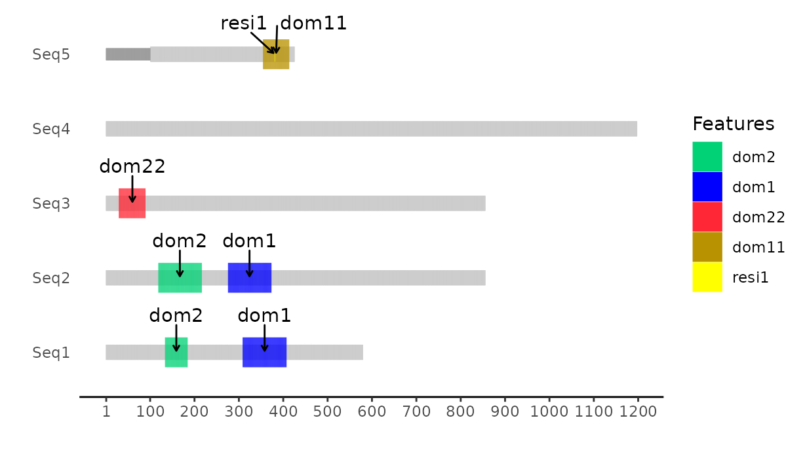

# seqvisr
Biological sequence visualization functions in `R`.

Consists of two functions: `msavisr()` and `pdomvisr()`.

`msavisr()` takes `FASTA`-formatted multiple sequence alignments (MSAs) as inputs and produces visualizations like the example below:

`pdomvisr()` takes appropriately formatted tabular data and produces domain structure diagrams like the one below:

## Installation
Ensure that the package [`devtools`](https://github.com/r-lib/devtools) is installed.

Then execute `devtools::install_github("vragh/seqvisr", build_manual = TRUE, build_vignettes = TRUE)` from within `R` to install the package. If the manual and package vignette are not necessary, `build_manual = TRUE, build_vignettes = TRUE` can be omitted.

## Usage
See `?seqvisr`, `?msavisr`, and `?pdomvisr` (from within `R`) to access documentation and examples. Run `browseVignettes("seqvisr")` to access the vignette.

## License
Released under GPL-3. A copy of the license file can be found in the file `LICENSE` (`LICENCE` is just for `R` purposes).
