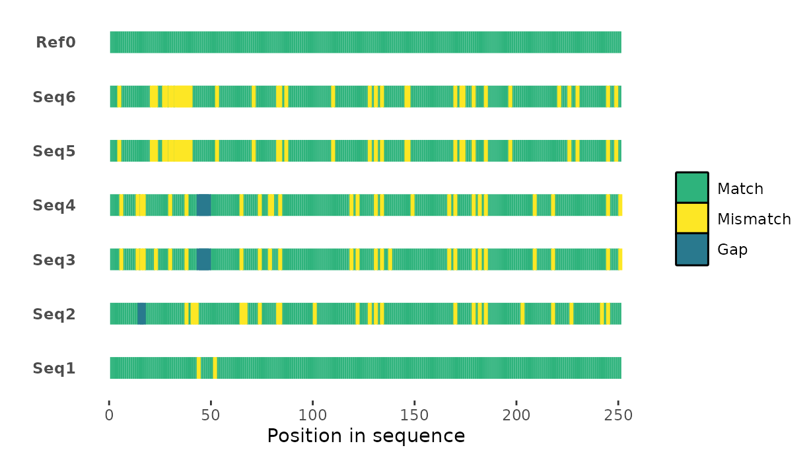
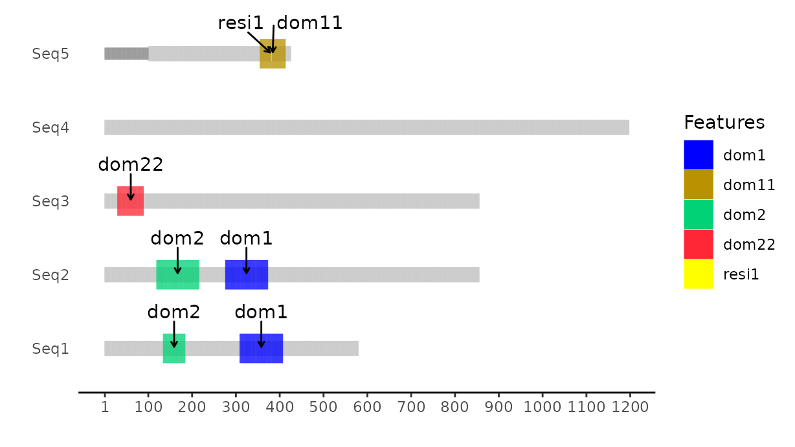

seqvisr
================

# seqvisr

Biological sequence visualization and auxiliary functions in `R`.

Consists of two main visualization functions: `msavisr()` and
`pdomvisr()`.

`msavisr()` takes `FASTA`-formatted multiple sequence alignments (MSAs)
as inputs and produces visualizations like the example below:

<!--  -->

<figure>

<figcaption aria-hidden="true">msavisr</figcaption>
</figure>

`pdomvisr()` takes appropriately formatted tabular data and produces
domain structure diagrams like the one below:

<!--  -->

<figure>

<figcaption aria-hidden="true">pdomvisr</figcaption>
</figure>

`cdsearchr()` now enables users to submit protein sequence sets to the
NCBI CD-SEARCH server and retrieve annotations as a `data.frame`
automatically. Example output below:

<!--  -->

<figure>

<figcaption aria-hidden="true">cdsearchr</figcaption>
</figure>

*NEW* as of `v0.2.7`: `fastodf()` and `fasdirdf()` are two small utility
functions that can be used to read in one or more FASTA files into `R`
as a `data.frame`. `fastodf()` can be used to read in a single FASTA
file, while `fasdirdf()` can be used to read in an entire directory’s
worth of FASTA files into a single `data.frame`. See `?fastodf` and
`?fasdirdf` for examples.

`list_files()` is a wrapper around `base::list.files()` that has been
introduced to account for `list.files()` including directory names by
default when `recursive = FALSE`. See `?list_files` for clarifications.

## Installation

Ensure that [`devtools`](https://github.com/r-lib/devtools) is
installed. Then execute
`devtools::install_github("vragh/seqvisr", build_manual = TRUE, build_vignettes = TRUE)`
from within `R` to install the package. If the manual and package
vignette are not necessary,
`build_manual = TRUE, build_vignettes = TRUE` can be omitted.

## Usage

See `?seqvisr`, `?msavisr`, `?pdomvisr`, and `?cdsearchr` (from within
`R`) to access documentation and examples for the main functions. Run
`browseVignettes("seqvisr")` to access the vignette.

## Citation

Please cite `seqvisr` using <https://doi.org/10.5281/zenodo.6583981>.

## License

Released under GPL-3. A copy of the license file can be found in the
file `LICENSE` (`LICENCE` is just for `R` purposes).
